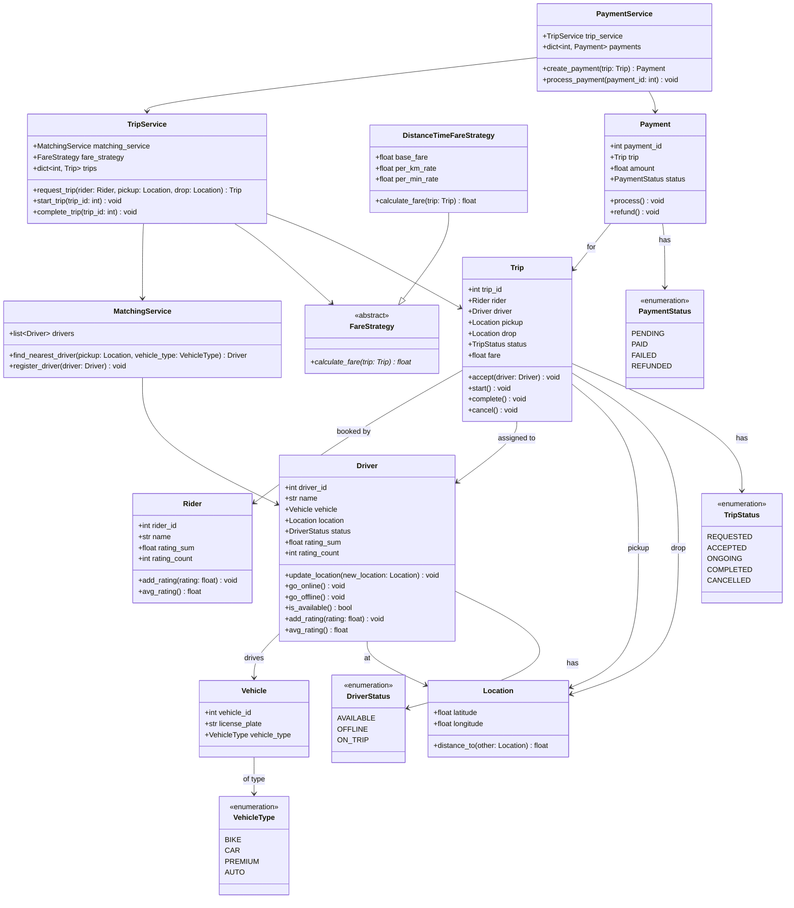

# Uber LLD - UML Class Diagram

High-level class diagram showing the core entities, enums, fare strategy hierarchy, and services that make up this Uber low-level design.

```mermaid
classDiagram
    class Rider {
        +int rider_id
        +str name
        +float rating_sum
        +int rating_count
        +add_rating(rating: float) void
        +avg_rating() float
    }

    class Vehicle {
        +int vehicle_id
        +str license_plate
        +VehicleType vehicle_type
    }

    class Driver {
        +int driver_id
        +str name
        +Vehicle vehicle
        +Location location
        +DriverStatus status
        +float rating_sum
        +int rating_count
        +update_location(new_location: Location) void
        +go_online() void
        +go_offline() void
        +is_available() bool
        +add_rating(rating: float) void
        +avg_rating() float
    }

    class Location {
        +float latitude
        +float longitude
        +distance_to(other: Location) float
    }

    class Trip {
        +int trip_id
        +Rider rider
        +Driver driver
        +Location pickup
        +Location drop
        +TripStatus status
        +float fare
        +accept(driver: Driver) void
        +start() void
        +complete() void
        +cancel() void
    }

    class Payment {
        +int payment_id
        +Trip trip
        +float amount
        +PaymentStatus status
        +process() void
        +refund() void
    }

    class VehicleType {
        <<enumeration>>
        BIKE
        CAR
        PREMIUM
        AUTO
    }

    class DriverStatus {
        <<enumeration>>
        AVAILABLE
        OFFLINE
        ON_TRIP
    }

    class TripStatus {
        <<enumeration>>
        REQUESTED
        ACCEPTED
        ONGOING
        COMPLETED
        CANCELLED
    }

    class PaymentStatus {
        <<enumeration>>
        PENDING
        PAID
        FAILED
        REFUNDED
    }

    class FareStrategy {
        <<abstract>>
        +calculate_fare(trip: Trip)* float
    }

    class DistanceTimeFareStrategy {
        +float base_fare
        +float per_km_rate
        +float per_min_rate
        +calculate_fare(trip: Trip) float
    }

    class MatchingService {
        +list~Driver~ drivers
        +find_nearest_driver(pickup: Location, vehicle_type: VehicleType) Driver
        +register_driver(driver: Driver) void
    }

    class TripService {
        +MatchingService matching_service
        +FareStrategy fare_strategy
        +dict~int, Trip~ trips
        +request_trip(rider: Rider, pickup: Location, drop: Location) Trip
        +start_trip(trip_id: int) void
        +complete_trip(trip_id: int) void
    }

    class PaymentService {
        +TripService trip_service
        +dict~int, Payment~ payments
        +create_payment(trip: Trip) Payment
        +process_payment(payment_id: int) void
    }

    Driver --> Vehicle : drives
    Driver --> Location : at
    Driver --> DriverStatus : has

    Vehicle --> VehicleType : of type

    Trip --> Rider : booked by
    Trip --> Driver : assigned to
    Trip --> Location : pickup
    Trip --> Location : drop
    Trip --> TripStatus : has

    Payment --> Trip : for
    Payment --> PaymentStatus : has

    DistanceTimeFareStrategy --|> FareStrategy

    TripService --> MatchingService
    TripService --> FareStrategy
    TripService --> Trip

    PaymentService --> TripService
    PaymentService --> Payment

    MatchingService --> Driver
```
